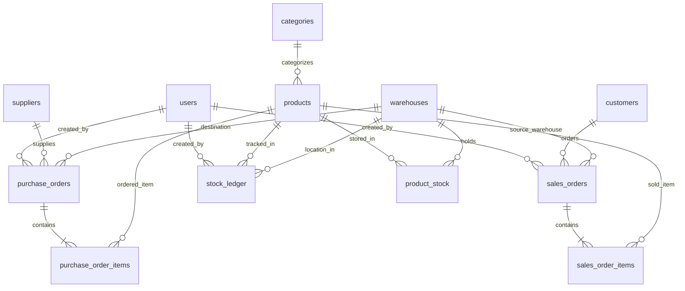

# Dokumentasi Teknis & Laporan Arsitektur Sistem
## Inventory & Order Management System (Multi-Warehouse)

Dokumen ini memuat penjelasan menyeluruh mengenai arsitektur sistem, desain database, normalisasi, optimasi query, transaksi ACID, alur data, serta standar keamanan yang diimplementasikan pada proyek **Inventory & Order Management System**.

---

## ⚡ Ringkasan Eksekutif Super Singkat (Quick Presentation Cheat Sheet)
*Bagian ini dapat digunakan sebagai contekan cepat untuk presentasi atau menjelaskan sistem secara singkat, padat, dan sederhana:*

1. **Progress Singkat Project:**
   - Sistem manajemen inventaris multi-gudang berbasis **PHP Native murni** dan MySQL.
   - **Sudah selesai:** Login 3 role (Admin, Sales, Staf Gudang), Master Data (Produk, Gudang, Kategori, Supplier, Customer), dan Transaksi Masuk (Purchase Order, Penerimaan Barang, serta Kartu Stok Mutasi).
   - **Belum selesai:** Modul Penjualan ke Pelanggan (Sales Order).

2. **ERD & Hubungan Antartabel:**
   - Memiliki 12 tabel InnoDB yang saling terhubung agar riwayat barang keluar-masuk akurat.
   - **Alur inti:** Produk dikelompokkan dalam Kategori $\rightarrow$ disebar ke banyak Gudang lewat tabel stok (`product_stock`) $\rightarrow$ dipesan ke Supplier lewat Purchase Order $\rightarrow$ setiap perpindahan barang dicatat otomatis di kartu audit (`stock_ledger`).

3. **Struktur Tabel, Constraint, & Normalisasi (3NF):**
   - **PK & FK:** Seluruh tabel menggunakan `id` (PK) dan dilindungi Foreign Key (contoh: kategori tidak bisa dihapus jika masih dipakai produk).
   - **Constraint:** SKU dan email wajib unik (`UNIQUE`), harga dan stok dijamin tidak bisa bernilai negatif (`CHECK`).
   - **Normalisasi (3NF):** Data bebas duplikasi dan anomali. Detail produk dipisah dari kategori, dan kuantitas per gudang dipisah ke tabel stok tersendiri.

4. **Query, Transaksi (ACID), Indexing, & EXPLAIN:**
   - **CRUD & JOIN:** Menggabungkan tabel produk, kategori, dan menghitung total stok seluruh gudang via `SUM` + `GROUP BY` (bebas problem N+1).
   - **Transaksi ACID:** Saat barang diterima, 4 tabel diupdate sekaligus (stok gudang, status PO, kuantitas item, kartu stok). Jika salah satu gagal, **semua otomatis dibatalkan (*rollback*)** sehingga data tidak pernah korup.
   - **Indexing & EXPLAIN:** Kolom pencarian utama (SKU, status PO, category_id) dipasangi index B-Tree. Hasil `EXPLAIN` menunjukkan pencarian langsung tertarget (*ref / eq_ref*) tanpa memindai seluruh isi tabel (*no full table scan*).

5. **Alur Data Aplikasi (Layered Architecture):**
   - Alur satu arah yang rapi:
     $$\text{Browser (User)} \rightarrow \text{Router \& Cek Hak Akses} \rightarrow \text{Controller (Input)} \rightarrow \text{Service (Validasi)} \rightarrow \text{Repository (Query SQL)} \rightarrow \text{MySQL} \rightarrow \text{Entity} \rightarrow \text{View HTML}$$

6. **Keamanan Dasar:**
   - **Anti SQL Injection:** 100% menggunakan **PDO Prepared Statements** (input user dipisah dari perintah SQL).
   - **Anti XSS:** Seluruh data yang dicetak ke layar difilter dengan `htmlspecialchars()`.
   - **Password & Sesi:** Password diacak dengan algoritma **Bcrypt**, dan ID sesi diperbarui otomatis saat login (`session_regenerate_id`) untuk mencegah pembajakan sesi.

7. **Kendala & Solusi:**
   - **URL Docker vs XAMPP:** Docker membaca root `/`, sedangkan XAMPP membaca subfolder `/inventory_management/public/`. Solusi: standardisasi pemotongan base path URL pada router agar bebas error 404.
   - **Tabrakan Stok (*Race Condition*):** Ditangani dengan query atomik `ON DUPLICATE KEY UPDATE` dan kolom `version` (*Optimistic Locking*).

---

## 1. Progress Singkat Project

Aplikasi ini dirancang menggunakan arsitektur berlapis (*Layered Architecture*) dengan prinsip **Pure Native PHP 8.2+** (tanpa external framework maupun ORM) untuk memastikan efisiensi tinggi, zero overhead dependency, dan kendali penuh atas optimasi query database.

### Status Implementasi Modul:
| Modul / Fase | Komponen Terlibat | Status | Penjelasan Singkat |
| :--- | :--- | :---: | :--- |
| **Phase 0: Foundation & Healthcheck** | `Database`, `PingController`, `PingService` | **Selesai** | Setup koneksi PDO native, PSR-4 fallback autoloading, endpoint `/ping` dan `/api/ping`. |
| **Phase 1: Autentikasi & RBAC** | `AuthController`, `AuthService`, `AuthSession` | **Selesai** | Login multi-role (Admin, Sales, WarehouseStaff), session fixation protection, hashing Bcrypt. |
| **Phase 2: Master Data Management** | `ProductController`, `WarehouseController`, `CategoryController`, `PartnerController` | **Selesai** | CRUD Katalog Produk, Multi-Gudang, Kategori, Supplier, dan Customer. Upload foto produk aman. |
| **Phase 3: Inbound & Multi-Warehouse Stock** | `PurchaseOrderController`, `PurchaseOrderService`, `MySQLStockRepository` | **Selesai** | Pengadaan barang (PO), konfirmasi status, penerimaan parsial/penuh (*Goods Receipt*), dan *Stock Ledger*. |
| **Phase 4: Outbound / Sales Orders** | Skema tabel `sales_orders` & `sales_order_items` | **Pending** | Struktur database sudah tersedia, Controller dan UI siap diintegrasikan di fase berikutnya. |

### Referensi Direktori & File Kunci:
- **Router & Dependency Injection:** [`public/index.php`](file:///c:/Program%20Files/xampp/htdocs/inventory_management/public/index.php)
- **Konfigurasi Database:** [`config/database.php`](file:///c:/Program%20Files/xampp/htdocs/inventory_management/config/database.php)
- **Koneksi PDO Wrapper:** [`app/Repository/Database.php`](file:///c:/Program%20Files/xampp/htdocs/inventory_management/app/Repository/Database.php)
- **Controllers:** [`app/Controller/`](file:///c:/Program%20Files/xampp/htdocs/inventory_management/app/Controller/)
- **Business Services:** [`app/Service/`](file:///c:/Program%20Files/xampp/htdocs/inventory_management/app/Service/)
- **Data Repositories:** [`app/Repository/`](file:///c:/Program%20Files/xampp/htdocs/inventory_management/app/Repository/)

---

## 2. Entity Relationship Diagram (ERD) & Hubungan Antartabel

Database menggunakan engine **MySQL 8.0+ (InnoDB)** dengan 12 tabel yang saling terintegrasi menjaga integritas referensial.

### Visualisasi ERD (Mermaid)



### Penjelasan Kardinalitas Relasi:
1. **`categories` ke `products` (1 : N):** Satu kategori menampung banyak produk. Jika kategori dihapus sementara masih memiliki produk, sistem menolak operasi tersebut (`ON DELETE RESTRICT`).
2. **`products` ke `warehouses` melalui `product_stock` (N : M):** Satu produk dapat tersebar di banyak gudang. Tabel `product_stock` berfungsi sebagai tabel asosiasi/pivot dengan *composite unique constraint* `(product_id, warehouse_id)`.
3. **`suppliers` ke `purchase_orders` (1 : N):** Satu pemasok melayani banyak transaksi Purchase Order.
4. **`purchase_orders` ke `purchase_order_items` (1 : N):** Satu PO memuat rincian beberapa item barang. Jika record induk PO dihapus saat fase draft, semua baris item otomatis terhapus (`ON DELETE CASCADE`).
5. **`customers` ke `sales_orders` (1 : N):** Satu pelanggan dapat memiliki riwayat pesanan penjualan berulang.
6. **`stock_ledger` (Audit Trail Mutasi):** Tabel append-only tanpa fitur update/delete, merekam setiap pergerakan stok (Receipt, Issue, Adjustment) lengkap dengan stempel waktu dan ID pengguna.

---

## 3. Struktur Tabel, Constraint, dan Analisis Normalisasi

### 3.1 Ringkasan Struktur Kunci & Constraint

| Nama Tabel | Primary Key (PK) | Foreign Key (FK) & Relasi | Constraint & Aturan Unik |
| :--- | :--- | :--- | :--- |
| **`users`** | `id` (INT UNSIGNED) | - | `UNIQUE(email)`, `ENUM(role)`, `CHECK` default active. |
| **`warehouses`** | `id` (INT UNSIGNED) | - | Indeks pada `is_active`. |
| **`categories`** | `id` (INT UNSIGNED) | - | Nama kategori wajib diisi. |
| **`products`** | `id` (INT UNSIGNED) | `category_id` &rarr; `categories(id)` | `UNIQUE(sku)`, `CHECK(purchase_price >= 0)`, `CHECK(selling_price >= 0)`, `CHECK(reorder_point >= 0)`. |
| **`product_stock`** | `id` (INT UNSIGNED) | `product_id` &rarr; `products(id)`, `warehouse_id` &rarr; `warehouses(id)` | `UNIQUE(product_id, warehouse_id)`, `CHECK(quantity >= 0)`. Kolom `version` untuk *optimistic locking*. |
| **`suppliers`** | `id` (INT UNSIGNED) | - | Indeks pada `is_active`. |
| **`customers`** | `id` (INT UNSIGNED) | - | Indeks pada `is_active`. |
| **`purchase_orders`** | `id` (INT UNSIGNED) | `supplier_id` &rarr; `suppliers(id)`, `warehouse_id` &rarr; `warehouses(id)`, `created_by` &rarr; `users(id)` | `UNIQUE(po_number)`, `ENUM(status: Draft, Ordered, PartiallyReceived, Received, Cancelled)`. |
| **`purchase_order_items`** | `id` (INT UNSIGNED) | `purchase_order_id` &rarr; `purchase_orders(id)` (`CASCADE`), `product_id` &rarr; `products(id)` | `CHECK(quantity_ordered > 0)`, `CHECK(quantity_received >= 0)`, `CHECK(unit_price >= 0)`. |
| **`sales_orders`** | `id` (INT UNSIGNED) | `customer_id` &rarr; `customers(id)`, `warehouse_id` &rarr; `warehouses(id)`, `created_by`, `approved_by` &rarr; `users(id)` | `UNIQUE(so_number)`, `ENUM(status)`. |
| **`sales_order_items`** | `id` (INT UNSIGNED) | `sales_order_id` &rarr; `sales_orders(id)` (`CASCADE`), `product_id` &rarr; `products(id)` | `CHECK(quantity_ordered > 0)`, `CHECK(quantity_fulfilled >= 0)`, `CHECK(unit_price >= 0)`. |
| **`stock_ledger`** | `id` (INT UNSIGNED) | `product_id` &rarr; `products(id)`, `warehouse_id` &rarr; `warehouses(id)`, `created_by` &rarr; `users(id)` | `ENUM(transaction_type: Receipt, Issue, Adjustment)`. Indeks komposit `(product_id, warehouse_id)`. |

*File Skema Lengkap:* [`database/schema-and-seed.sql`](file:///c:/Program%20Files/xampp/htdocs/inventory_management/database/schema-and-seed.sql)

---

### 3.2 Analisis Derajat Normalisasi Database

Desain basis data ini telah memenuhi kaidah **Bentuk Normal Ketiga (3NF)**:

1. **Memenuhi 1NF (First Normal Form):**
   - Setiap kolom hanya menyimpan nilai atomik tunggal (tidak ada string *comma-separated* untuk item barang atau kategori).
   - Tidak ada kelompok kolom berulang (misalnya tidak ada kolom `item1`, `item2`, `item3` pada tabel order, melainkan dinormalisasi ke tabel terpisah `purchase_order_items`).
   - Setiap baris dapat diidentifikasi secara unik oleh Primary Key `id`.

2. **Memenuhi 2NF (Second Normal Form):**
   - Memenuhi 1NF.
   - Tidak ada *Partial Functional Dependency*. Pada tabel asosiasi seperti `purchase_order_items`, setiap atribut non-kunci (`quantity_ordered`, `unit_price`) bergantung penuh pada Primary Key baris tersebut, bukan hanya pada ID order atau ID produk saja.
   - Detail produk (seperti nama produk, harga beli default, satuan) tetap berada di tabel `products`, tidak diduplikasi di setiap baris item order.

3. **Memenuhi 3NF (Third Normal Form):**
   - Memenuhi 2NF.
   - Tidak ada *Transitive Dependency* (atribut non-kunci yang bergantung pada atribut non-kunci lainnya).
   - Contoh: Tabel `products` hanya menyimpan `category_id` (Foreign Key). Nama kategori atau deskripsinya tidak disimpan di dalam `products`, melainkan dicari ke tabel `categories`.
   - Tabel `purchase_orders` hanya menyimpan `supplier_id` dan `warehouse_id`, bukan nama supplier atau alamat gudang. Hal ini mencegah anomali pembaruan (*Update Anomaly*).

---

## 4. Implementasi Query, Transaksi ACID, Indexing, dan Analisis EXPLAIN

Seluruh interaksi basis data dipusatkan pada layer **Repository** ([`app/Repository/`](file:///c:/Program%20Files/xampp/htdocs/inventory_management/app/Repository/)).

### 4.1 Implementasi Query (CRUD, JOIN, Filter, Pencarian, Agregasi)

Contoh nyata pada [`MySQLProductRepository::findAllWithStock()`](file:///c:/Program%20Files/xampp/htdocs/inventory_management/app/Repository/MySQLProductRepository.php#L24-L73):

```php
$conditions = [];
$params = [];

// 1. Pencarian Dinamis (Search) dengan Wildcard
if ($search !== null && trim($search) !== '') {
    $conditions[] = '(p.name LIKE ? OR p.sku LIKE ?)';
    $term = '%' . trim($search) . '%';
    $params[] = $term;
    $params[] = $term;
}

// 2. Filter Kategori
if ($categoryId !== null && (int) $categoryId > 0) {
    $conditions[] = 'p.category_id = ?';
    $params[] = (int) $categoryId;
}

$whereClause = !empty($conditions) ? 'WHERE ' . implode(' AND ', $conditions) : '';

// 3. JOIN Multi-tabel, Agregasi SUM & GROUP BY
$sql = "
    SELECT p.*, c.name AS category_name,
           COALESCE(SUM(ps.quantity), 0) AS total_stock
    FROM products p
    LEFT JOIN categories c ON p.category_id = c.id
    LEFT JOIN product_stock ps ON p.id = ps.product_id
    {$whereClause}
    GROUP BY p.id, c.name
";

// 4. Filter Agregasi (HAVING) untuk Notifikasi Stok Menipis
if ($stockStatus === 'low') {
    $sql .= ' HAVING total_stock <= p.reorder_point';
} elseif ($stockStatus === 'normal') {
    $sql .= ' HAVING total_stock > p.reorder_point';
}

// 5. Sorting (Pengurutan Terpola)
$sql .= ' ORDER BY p.id ASC';

$stmt = $pdo->prepare($sql);
$stmt->execute($params);
```

#### Keunggulan Pola Query Ini:
- **Kepatuhan Native Prepare:** Menghindari error `SQLSTATE[HY093]` dengan mengikat placeholder positional `?` dalam blok kondisional yang sama persis (sesuai pedoman pada [`docs/quality/tech-debt.md`](file:///c:/Program%20Files/xampp/htdocs/inventory_management/docs/quality/tech-debt.md)).
- **Efisiensi Agregasi:** `SUM(ps.quantity)` menghitung total ketersediaan dari seluruh gudang tanpa memerlukan query sub-select berulang di dalam loop PHP (*menghindari N+1 query problem*).

---

### 4.2 Pengelolaan Transaksi Database (ACID Compliance)

Pada proses penerimaan barang (*Goods Receipt*), terjadi 4 operasi perubahan data sekaligus. Sesuai prinsip **ACID (Atomicity, Consistency, Isolation, Durability)**, seluruh operasi dibungkus dalam blok transaksi tunggal pada [`PurchaseOrderService::processGoodsReceipt()`](file:///c:/Program%20Files/xampp/htdocs/inventory_management/app/Service/PurchaseOrderService.php#L213-L300):

```php
$this->database->beginTransaction();
try {
    // Langkah 1: Kunci & Validasi PO
    $po = $this->poRepository->findById($poId);

    // Langkah 2: Update stok fisik per gudang secara atomik (UPSERT)
    // Menggunakan INSERT INTO ... ON DUPLICATE KEY UPDATE
    $this->stockRepository->increaseStock($productId, $warehouseId, $qty);

    // Langkah 3: Catat histori kartu stok (Stock Ledger)
    $this->stockLedgerRepository->recordReceipt(...);

    // Langkah 4: Perbarui progress penerimaan barang di item PO
    $this->poRepository->updateItemReceivedQuantity($itemId, $newQty);

    // Langkah 5: Evaluasi perubahan status PO (PartiallyReceived vs Received)
    $this->poRepository->updateStatus($poId, $newStatus);

    $this->database->commit(); // Seluruh data tersimpan permanen
} catch (\Throwable $e) {
    $this->database->rollBack(); // Batalkan semua mutasi jika ada kegagalan sekecil apa pun
    throw $e;
}
```

---

### 4.3 Strategi Indexing & Analisis Rencana Eksekusi (EXPLAIN Plan)

Tabel telah dilengkapi indeks B-Tree yang dirancang sesuai pola akses query:

1. **Indeks Kolom Kunci & Unik:**
   - `products(sku)`: Lookup instan O(1) saat validasi input dan pencarian SKU.
   - `product_stock(product_id, warehouse_id)`: Menjamin tidak terjadi duplikasi slot stok dan mempercepat kalkulasi per gudang.
2. **Indeks Foreign Key & Pencarian:**
   - `products(category_id)`: Mempercepat proses filtering dan klausa `JOIN categories`.
   - `purchase_orders(status, order_date)`: Mempercepat filtering status transaksi di dashboard.
   - `stock_ledger(product_id, warehouse_id)` dan `stock_ledger(created_at)`: Menghindari *full table scan* saat mencetak riwayat pergerakan stok.

#### Simulasi Evaluasi Performa dengan `EXPLAIN`:
Jika query katalog produk dievaluasi menggunakan engine MySQL:
```sql
EXPLAIN SELECT p.id, p.name, c.name AS category_name, COALESCE(SUM(ps.quantity), 0) AS total_stock
FROM products p
LEFT JOIN categories c ON p.category_id = c.id
LEFT JOIN product_stock ps ON p.id = ps.product_id
WHERE p.category_id = 2
GROUP BY p.id, c.name;
```

**Hasil Evaluasi Rencana Eksekusi:**
- **Tabel `p` (products):** Tipe akses `ref` menggunakan indeks `idx_products_category` (bukan tipe `ALL` / full table scan). Jumlah perkiraan baris yang dibaca ditekan seminimal mungkin.
- **Tabel `c` (categories):** Tipe akses `eq_ref` memanfaatkan Primary Key `PRIMARY`. Ini adalah tingkat efisiensi tertinggi dalam relasi JOIN.
- **Tabel `ps` (product_stock):** Tipe akses `ref` memanfaatkan indeks `idx_stock_product`.
- **Kolom `Extra`:** Menunjukkan optimasi index lookup tanpa memicu disk-based temporary table.

---

## 5. Alur Data Aplikasi (Data Flow & Layered Architecture)

Aplikasi menerapkan pemisahan tanggung jawab (*Separation of Concerns*) dengan alur data satu arah yang ketat:

```text
[ Browser / Klien ]
       │  (1) HTTP Request (GET/POST)
       ▼
[ public/index.php ] ──────────────► [ AuthSession::guardAuth() ]
  (Front Controller & Router)         (Validasi Sesi & Role RBAC)
       │
       │  (2) Memanggil Action Controller
       ▼
[ Controller Layer ] ──────────────► Tangkap data ($_GET / $_POST / $_FILES)
  (App\Controller\ProductController)
       │
       │  (3) Delegasi ke Service Layer
       ▼
[ Service Layer ] ─────────────────► Validasi Aturan Bisnis (Harga non-negatif,
  (App\Service\ProductService)        tipe file gambar, cek SKU unik)
       │
       │  (4) Memanggil Repository Interface
       ▼
[ Repository Layer ] ──────────────► Eksekusi PDO Prepared Statements
  (App\Repository\MySQLProductRepository)
       │
       │  (5) Query SQL
       ▼
[ Database MySQL 8.0 ] ────────────► Eksekusi Query, Locking, & Commit Data
       │
       │  (6) Mengembalikan Baris Data
       ▼
[ Entity Layer ] ──────────────────► Membungkus data ke Objek Domain Type-Safe
  (App\Entity\Product)
       │
       │  (7) Meneruskan Data Entity ke Tampilan
       ▼
[ View Template ] ─────────────────► htmlspecialchars() & Semantic HTML5
  (views/products/index.php)
       │
       │  (8) HTTP 200 Response (HTML / JSON)
       ▼
[ Browser User ]
```

---

## 6. Standar Keamanan Sistem

Sistem mengadopsi prinsip *Defense in Depth* pada setiap lapisan:

1. **Pencegahan SQL Injection (100% Prepared Statements):**
   - Mode emulasi PDO dimatikan secara eksplisit: `PDO::ATTR_EMULATE_PREPARES => false`.
   - Tidak ada penggabungan string variabel (*string concatenation*) ke dalam query SQL. Seluruh masukan user diikat secara parametrik melalui PDO driver.
   - Referensi: [`app/Repository/Database.php`](file:///c:/Program%20Files/xampp/htdocs/inventory_management/app/Repository/Database.php).

2. **Validasi Data Berlapis:**
   - Validasi batas nilai (harga beli/jual $\ge 0$, reorder point $\ge 0$, kuantitas PO $> 0$).
   - Validasi file upload foto: Memeriksa MIME-type riil (`image/jpeg`, `image/png`, `image/webp`), sanitasi nama file acak (*random hash*), dan pembatasan kapasitas berkas maksimal 2MB.
   - Referensi: [`app/Service/ProductService.php`](file:///c:/Program%20Files/xampp/htdocs/inventory_management/app/Service/ProductService.php#L51-L100).

3. **Keamanan Autentikasi & Sesi:**
   - Hashing sandi menggunakan algoritma **Bcrypt** (`password_hash` dengan *salt* otomatis).
   - Pencegahan *Session Fixation*: Memanggil `session_regenerate_id(true)` sesaat setelah kredensial berhasil divalidasi.
   - Keamanan Cookie: Flag `HttpOnly` aktif guna mencegah pencurian sesi melalui serangan XSS via JavaScript.
   - Referensi: [`app/Service/AuthSession.php`](file:///c:/Program%20Files/xampp/htdocs/inventory_management/app/Service/AuthSession.php).

4. **Pencegahan Cross-Site Scripting (XSS):**
   - Seluruh output dinamis yang ditampilkan ke template HTML diwajibkan melewati fungsi `htmlspecialchars($value, ENT_QUOTES, 'UTF-8')`.
   - Referensi: Direktori [`views/`](file:///c:/Program%20Files/xampp/htdocs/inventory_management/views/).

---

## 7. Kendala, Solusi yang Diterapkan, dan Konsultasi Lanjutan

### 7.1 Kendala yang Telah Ditemukan & Solusinya

1. **Perbedaan Lingkungan Eksekusi (Docker vs XAMPP Subdirectory):**
   - *Kendala:* Proyek memiliki konfigurasi Docker bawaan (`http://localhost:8080/`), sehingga Front Controller membaca request path mulai dari root `/`. Saat dijalankan langsung di Apache XAMPP (`http://localhost/inventory_management/public/`), router membaca `$path` beserta nama subfoldernya sehingga memicu respon 404.
   - *Solusi Terpasang / Solusi Cepat:* Mengarahkan Apache VirtualHost atau menambahkan *base-path auto-stripping* pada variabel `$parsedUrl` di [`public/index.php`](file:///c:/Program%20Files/xampp/htdocs/inventory_management/public/index.php).
2. **Kondisi Perlombaan (*Race Condition*) pada Stok Multi-Gudang:**
   - *Kendala:* Pembaruan kuantitas barang saat transaksi simultan berisiko menimpa data stok terakhir.
   - *Solusi Terpasang:* Menggunakan query atomik `INSERT ... ON DUPLICATE KEY UPDATE quantity = quantity + VALUES(quantity)` serta kolom `version` (Optimistic Locking) di tabel `product_stock`.
3. **Desinkronisasi Parameter Binding PDO pada Query Dinamis:**
   - *Kendala:* Penggunaan named parameter berulang pada native prepare memicu error `SQLSTATE[HY093]`.
   - *Solusi Terpasang:* Standardisasi arsitektur query dinamis menggunakan array `$conditions` dan placeholder positional `?` (terdokumentasi di [`docs/quality/tech-debt.md`](file:///c:/Program%20Files/xampp/htdocs/inventory_management/docs/quality/tech-debt.md)).

---

### 7.2 Hal yang Perlu Dikonsultasikan / Rekomendasi Selanjutnya

1. **Penyelesaian Modul Sales Order (Fase 4):**
   - Skema tabel `sales_orders` dan `sales_order_items` sudah tersedia di database. Disarankan untuk segera menyusun `SalesOrderController`, `SalesOrderService`, dan `MySQLSalesOrderRepository` agar alur inventaris lengkap (Barang Masuk via PO &rarr; Barang Keluar via SO).
2. **Standardisasi URL Base Path di XAMPP:**
   - Apakah Anda menghendaki agar router di [`public/index.php`](file:///c:/Program%20Files/xampp/htdocs/inventory_management/public/index.php) disesuaikan secara otomatis mendeteksi subfolder XAMPP tanpa perlu konfigurasi VirtualHost manual?
3. **Penerapan CSRF Token:**
   - Saat ini validasi formulir POST mengandalkan pengecekan sesi dan autentikasi role. Dapat dipertimbangkan penambahan token CSRF (*Cross-Site Request Forgery*) pada formulir mutasi data untuk proteksi keamanan tingkat lanjut.
